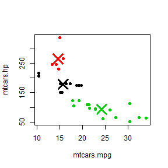

---

title       : Cars K-mean clustering pitch
subtitle    : 
author      : Sergey Nazarov
job         : 
framework   : io2012        # {io2012, html5slides, shower, dzslides, ...}
highlighter : highlight.js  # {highlight.js, prettify, highlight}
hitheme     : tomorrow      # 
widgets     : []            # {mathjax, quiz, bootstrap}
mode        : selfcontained # {standalone, draft}
knit        : slidify::knit2slides

--- .class #id 

<div id="bg">
  
</div>

--- .class #id 

## What is this application for

- ### Application allows you to explore mtcars dataset, whether there are clusters of cars.   
   
- ### It uses k-means method of classification.

- ### You should choose two variables and input a number of clusters (your intuition guess).   

- ### Application produces a two dimentional plot and shows centers of possible clusters.

--- &twocol w1:40% w2:60%

## Motor Trend Car Road Tests
Description     
The data was extracted from the 1974 Motor Trend US magazine, and comprises fuel consumption and 10 aspects of automobile design and performance for 32 automobiles (1973 - 74 models).   
Variables are:

*** =left

- mpg	 Miles/(US) gallon
- cyl	 Number of cylinders
- disp	 Displacement (cu.in.)
- hp	 Gross horsepower
- drat	 Rear axle ratio

*** =right

- wt	 Weight (1000 lbs)
- qsec	 1/4 mile time
- vs	 V/S
- am	 Transmission (0 = automatic, 1 = manual)
- gear	 Number of forward gears
- carb	 Number of carburetors   


--- .class #id 

After you choose number of clusters and two variables it produces a plot:


```r
kmeansObj <- kmeans(data.frame(mtcars$mpg, mtcars$hp), centers = 3)
plot(data, col = kmeansObj$cluster, pch = 19)
points(kmeansObj$centers, col = 1:3, pch = 4, cex = 3, lwd = 3)
```

 

### You can find this app here and explore it by yourself:

https://sn2015.shinyapps.io/carsclastersapp


